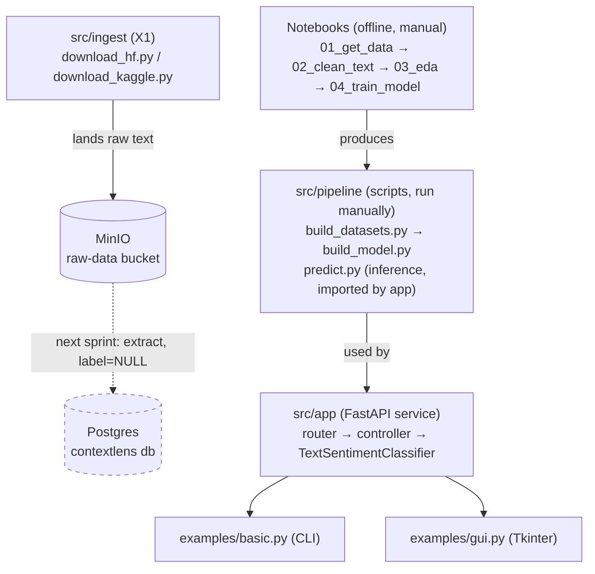

# Architecture — Sprint X1

## Layers

`src/ingest` is a parallel, not-yet-connected track — its output (MinIO raw files) doesn't feed `src/pipeline` yet. That wiring happens next sprint (Postgres extraction, dashed line above) and the sprint after (vLLM/DSPy labelling), which will eventually replace `build_datasets.py`'s `artifacts/Text_dataset.br` input. Until then the two flows are independent; v1.0.0's pipeline is unchanged.

## Components

| Component                 | Path                                                            | Role                                                                                                                                                                                              |
| ------------------------- | --------------------------------------------------------------- | ------------------------------------------------------------------------------------------------------------------------------------------------------------------------------------------------- |
| `TextPreprocessor`        | `src/utils/text_preprocessor.py`                                | Pure text cleaning (HTML, mentions, links, emoji, contractions, abbreviations). No model dependency.                                                                                              |
| `CustomBERTClassifier`    | `src/utils/custom_BERT_classifier.py`                           | `bert-base-uncased` + 3-layer FC head, **softmax applied inside `forward()`**.                                                                                                                    |
| `TextDataset`             | `src/utils/text_dataset.py`                                     | Wraps `BertTokenizer`, tokenizes on `__getitem__`. Tokenizer loaded once via `lru_cache`d `get_tokenizer()`, cached on the classifier and reused across requests (DECISIONS.md #6, fixed v1.0.1). |
| `TextSentimentClassifier` | `src/pipeline/predict.py`                                       | Inference facade: preprocess → tokenize → forward → label.                                                                                                                                        |
| FastAPI app               | `src/app/main.py` + `routers/` + `controllers/` + `interfaces/` | 3 REST endpoints, classifier instantiated once at module import.                                                                                                                                  |
| `HfDownloader`            | `src/ingest/download_hf.py`                                     | Downloads 4 confirmed HF sources, lands raw parquet in MinIO. Doesn't stop on one source's failure — collects failures, returns list.                                                             |
| `KaggleDownloader`        | `src/ingest/download_kaggle.py`                                 | Downloads 2 confirmed Kaggle sources, lands raw files in MinIO. Same failure-collection shape as `HfDownloader`.                                                                                  |
| `MinioClient`             | `src/ingest/minio_client.py`                                    | Thin wrapper over the `minio` SDK — env-var-driven connection, single `upload_file` method.                                                                                                       |

## Request path

`POST /predict` → router → controller (`predict_sentiment`, preprocesses once) → `TextSentimentClassifier.classify_sentiment(cleaned_text)` → tokenize (cached tokenizer) → BERT forward → single softmax (from `forward()`, no re-softmax — DECISIONS.md #1, fixed v1.0.1) → label.

## Known structural gaps

- No dependency injection — classifier is a module-level global, loaded at import time. Can't swap/mock for tests without loading real BERT weights.
- No shared config/settings module — model path is a string literal duplicated in `controller.py`, `examples/basic.py`, `examples/gui.py`.
- `/health` exists and is readiness-aware — reports real `model_loaded` state, 503 when false (DECISIONS.md #4, fixed v1.0.1). Caveat: with `--workers 4` each worker holds its own `model_loaded`; a single-worker-per-container setup is now used so the probe reflects the whole container (see INFRA.md/Dockerfile).
- `src/ingest` scripts have no dedup/skip-if-exists check — a rerun re-downloads and re-uploads everything, no idempotency guard.

See `DECISIONS.md` for the full bug/gap list, `PIPELINE.md` for the training-side detail.
